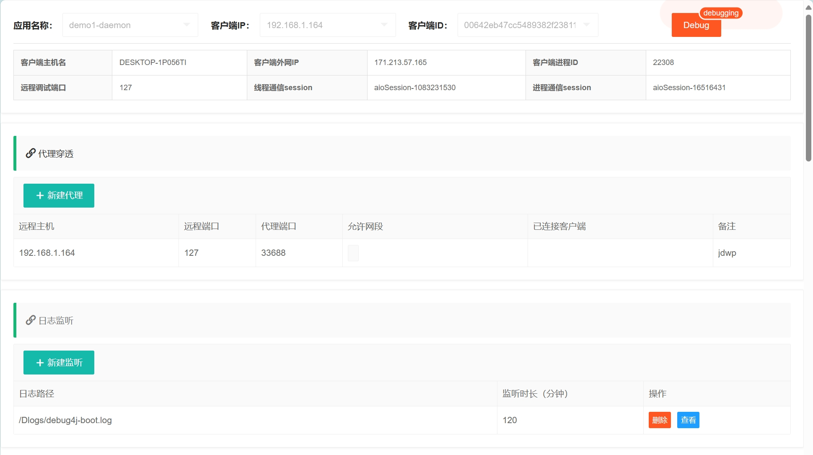
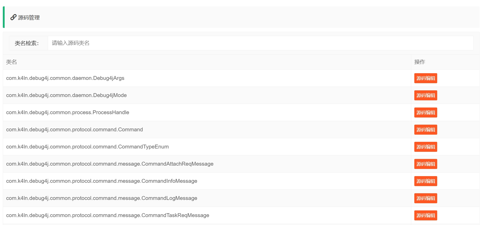
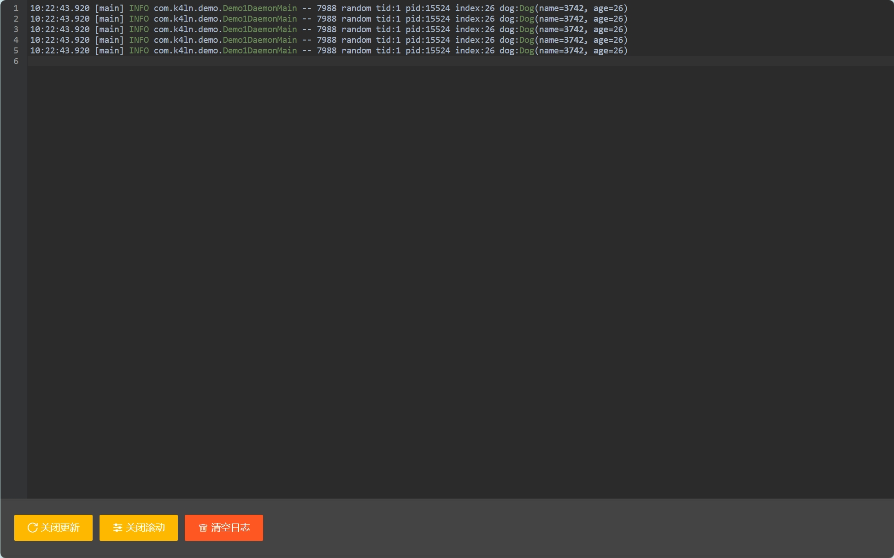
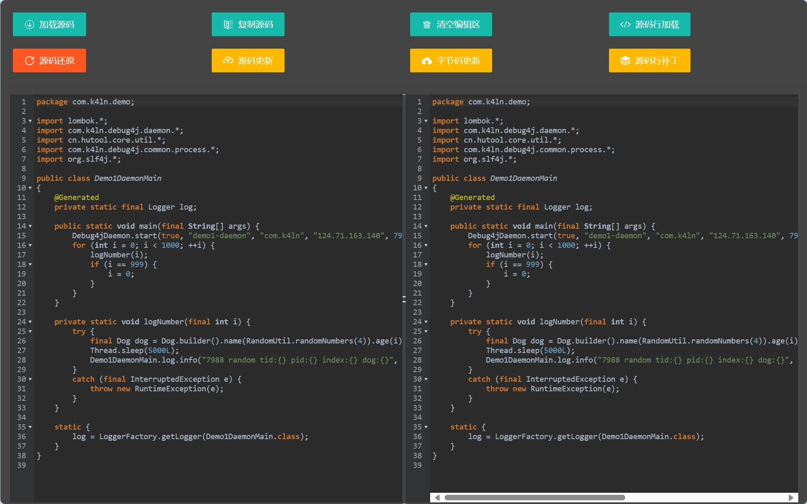
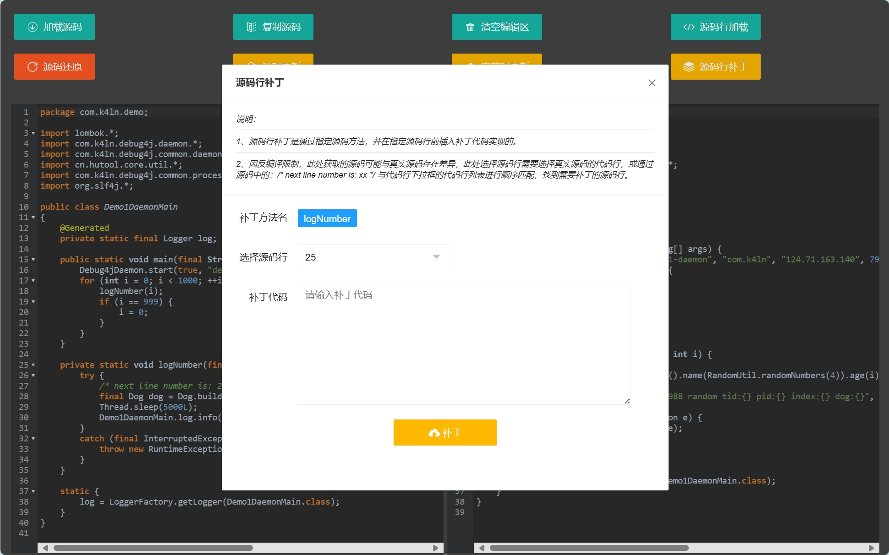

# Debug4j

**Debug4j** is an efficient and user-friendly Java debugging tool focused on debugging Java code on remote servers. It enables visual remote code modification and debugging through a creative approach, offering easy deployment and seamless integration.

### Supported Versions
- This repository is compatible with JDK 17 and above.
- For JDK 8, please refer to [debug4j-jdk8](https://github.com/ifeng113/debug4j-jdk8).

---

## Features

- **Proxy Penetration Service**: Enables remote proxy penetration in isolated environments like Docker and Kubernetes.
- **JWDP Remote Debugging**: Simplifies remote debugging configuration.
- **Log File Monitoring**: Retrieves real-time application log information.
- **Class and Source Code Reading**: Dynamically loads and parses target program classes and source code.
- **Source Code Hot Update**: Supports runtime dynamic updates to source code.
- **Bytecode Hot Update**: Allows direct modification and updating of bytecode.
- **Line-level Code Injection**: Quickly inserts debugging code.
- **Code Reversion**: Restores code to its state before updates.

---

## Quick Start

### Setting Up the Server

1. Pull the Docker image:
   ```bash
   docker pull k4ln/debug4j-server:0.0.1.1
   ```

2. Start the server:
   ```bash
   docker run --net=host -d --name debug4j-server k4ln/debug4j-server:0.0.1.1
   ```

3. Configure the communication key and API key:
   ```bash
   docker run --net=host -d --name debug4j-server k4ln/debug4j-server:0.0.1.1 \
       --debug4j.key=k4ln --sa-token.http-basic='k4ln:123456'
   ```

   - `--debug4j.key`: Sets the communication key.
   - `--sa-token.http-basic`: Sets the API communication key.

> **Port Details**

- `7987`: API and web debugging port. Visit [http://debug4j-server:7987](http://debug4j-server:7987) for the debugging management page.
- `7988`: Communication port between debug4j-server and the target application. Configurable with `--debug4j.socket-port`.
- `33000-34000`: Default proxy open port range for debug4j-server. If the server is deployed on a public network, close these firewall ports. Configurable with `--debug4j.min-proxy-port` and `--debug4j.max-proxy-port`.

> API documentation is available in [Debug4j.postman_collection.json](https://github.com/ifeng113/debug4j/blob/master/src/main/resources/Debug4j.postman_collection.json).

> **Debugging Configuration + Proxy Management + Log Management**



> **Source Code Management**



> **Log Monitoring**



> **Source Code Hot Update**



> **Source Code Patching**



---

### Java Application Integration

Add the following dependency to your project:
```xml
<dependency>
    <groupId>io.github.ifeng113</groupId>
    <artifactId>debug4j-daemon</artifactId>
    <version>0.0.1</version>
</dependency>
```

Start Debug4j in your application:
```java
Debug4jDaemon.start(true, "demo1-daemon", "com.k4ln", "192.168.1.13", 7988, "k4ln");
```
Refer to the example code in [debug4j-demo1](https://github.com/ifeng113/debug4j/tree/master/debug4j-demo1).

---

### Spring Boot Integration

Add the following dependency to your project:
```xml
<dependency>
    <groupId>io.github.ifeng113</groupId>
    <artifactId>debug4j-spring-boot-starter</artifactId>
    <version>0.0.1</version>
</dependency>
```

Configure Debug4j in `application.yml`:
```yaml
debug4j:
  package-name: com.k4ln
  host: 192.168.1.13
  port: 7988
  key: k4ln
```
Refer to the example code in [debug4j-demo2](https://github.com/ifeng113/debug4j/tree/master/debug4j-demo2).

---

## Limitations and Considerations

1. **Class Signature Restrictions**:
   - Code hot updates or bytecode hot updates cannot modify class field names or method signatures (i.e., class signatures).
   - While the JVM supports adding methods and variables, it does not support deletion. Debug4j currently supports changes only within method bodies.

2. **Agent Compatibility Issues**:
   - Agents (e.g., ByteBuddy) may modify bytecode, causing source code hot update and bytecode hot update functions to become unavailable.
   - It is recommended to avoid using agents or adjust related configurations.

3. **Bytecode Version Compatibility**:
   - Ensure the compiled version of the class files used for hot updates is compatible with the target JVM.

4. **Code Line Patch Considerations**:
   - When using third-party utility classes, use fully qualified paths to avoid compilation failures due to class name conflicts.

   Example:
   ```json
   {
       "clientSessionId": "aioSession-1341587928",
       "className": "com.k4ln.demo.Demo1DaemonMain",
       "lineMethodName": "logNumber",
       "lineNumber": 24,
       "sourceCode": "log.info(\"com.alibaba.fastjson2.JSON.toJSONString(patch13)\");"
   }
   ```

5. **Application Integration Restrictions**:
   - Application integration allows using JDK as the base image. For JDK 8, it is recommended to use: ```eclipse-temurin:17.0.13_11-jdk```. More images can be found at: https://hub.docker.com/_/eclipse-temurin/tags?page=1
   - If remote debugging is enabled, you need to manually configure the following when starting Java: ```-agentlib:jdwp=transport=dt_socket,server=y,suspend=n,address=5005.```

---

## Acknowledgments

- [Smart-Socket](https://github.com/smartboot/smart-socket)
- [Sa-Token](https://github.com/dromara/sa-token)
