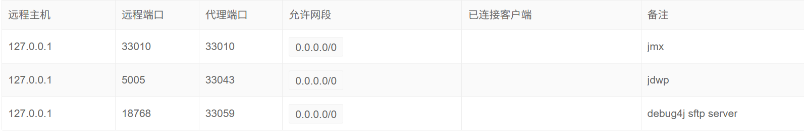
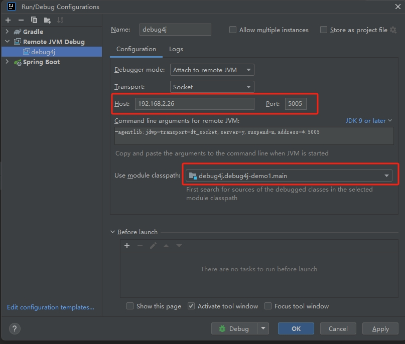
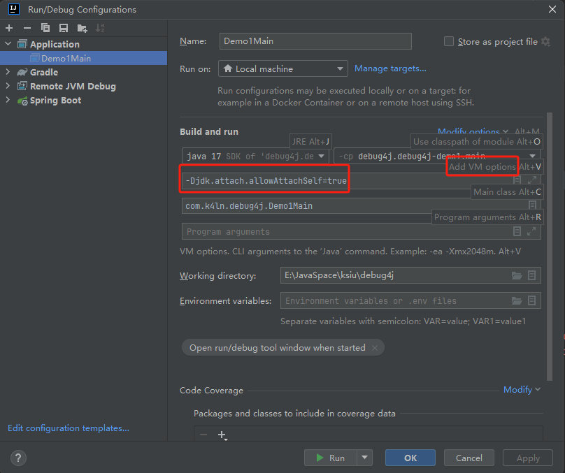

### mark3

docker run -d -p 33999:33999 -e JAVA_OPTIONS='-Ddebug4j.host=10.0.0.14 -agentlib:jdwp=transport=dt_socket,server=y,suspend=n,address=*:5005 -Dcom.sun.management.jmxremote -Dcom.sun.management.jmxremote.port=33010 -Dcom.sun.management.jmxremote.rmi.port=33010 -Dcom.sun.management.jmxremote.authenticate=false -Dcom.sun.management.jmxremote.ssl=false -Djava.rmi.server.hostname=122.152.214.33' --name demo2 com.k4ln/debug4j-demo2:0.0.1-snapshot



### mark2

1、使用agent可能改变字节码，特别是ByteBuddy，会导致源码热更新与字节码热更新功能不可用；在JDK8的情况下，行补丁因无法反编译执行源码，也不可用
- 因此使用debug4j时推荐【尽量不使用agent，或修改agent相关配置】，后续debug4j会集成常用agent功能以便替代使用
- 相关问题arthas也存在
	-> 【skywalking兼容arthas问题】：https://blog.csdn.net/weixin_42106289/article/details/128467219
	-> 【java.lang.ClassFormatError: null、skywalking arthas 兼容使用】：https://arthas.aliyun.com/doc/faq.html#java-lang-classformaterror-null%E3%80%81skywalking-arthas-%E5%85%BC%E5%AE%B9%E4%BD%BF%E7%94%A8

2、debug4j-boot（进程代理模式），在更改代码后需要对debug4j-boot与debug4j-packing进行shadowJar，因为debug4j-daemon是通过创建java子进程（debug4j-packing压缩包中的debug4j-boot.jar）运行的，而不是源码编译运行
- 后续考虑debug4j-boot启动增加版本号相关打印，以方便确认maven中央仓库中的debug4j-packing包含的debug4j-boot.jar是否为相应版本

3、字节码热更新请注意class文件的jdk编译版本兼容问题，版本不兼容无法如热更新；同时-javaagent指定的agent编译版本也需要保持与主程序的JDK版本兼容

4、debug4j无论是代码热更新还是字节码热更新均无法修改字段名和方法名等修改类签名行为，强制修改会导致热更新失败
- 在JVM中，已经加载的类结构（字段、方法）是固定的，类的签名信息已经固定了
- instrumentation.retransformClasses不支持涉及到类签名信息的新增、修改及删除（已定义的类签名信息：包含变量类型、变量名、方法名称、方法参数、方法返回值）
- 通过javassist/ByteBuddy可以实现动态新增方法或变量，但都是直接生成一个新的Class对象，无法对JVM原有的类直接进行加强（原有代码无法直接使用新类）
- debug4j暂时不考虑适配涉及改变类签名的相关功能，debug4j更侧重于对方法体内的修改（偏调试方向，而非热编码业务方向）

5、前端换行使用\n作为换行标识

6、行补丁代码三方工具类尽量使用含包名的全路径，防止重名类造成编译失败，如：
```json
{
    "clientSessionId": "aioSession-1341587928",
    "className": "com.k4ln.demo.Demo1DaemonMain",
    "lineMethodName": "logNumber",
    "lineNumber": 24,
    "sourceCode": "log.info(\"com.alibaba.fastjson2.JSON.toJSONString(patch13)\");"
}
```

7、行源码查询需要指定，如果使用过agent可能导致方法名变成了代码方法名等，需要先查询源码（方法名传空）获取到真实方法名，再查询具体方法行号信息

8、行源码返回的行号数组需要根据返回的首行行号按行顺序与行号列表依次匹配行号，因代码中可能存在"\n"字符和补丁行干扰，暂时先返给前端，补丁代码时需要开发者判断并传入行号
- 后续通过遍历行代码（需要过滤补丁代码，因为补丁代码反编译会换行，但实际不占用行号），再代码行末增加行号注释，如：// 24

9、行代码补丁是默认通过在代码行行首插入代码实现。需注意插入的代码不会影响行号，但是反编译出的结果会分行展示，当有插入补丁代码时，反编译后会自动在增加的代码行后标记下一行的行号

10、更多备注
- 本地编译 IDEA | Gradle 调试区别，见：debug4j-server#CodeLockAspect
- 代码热更新不能作用于正在运行的方法，同arthas
- 暂时未实现applicationName与代理配置绑定（现在为session绑定，项目更新后需要重新绑定），因此未实现代理配置删除功能【懒】
- 使用jdwp远程调试时，进程会被阻塞，同时阻塞的还有debug4j底层通信模块，这会导致attach相关功能可能异常，请尽量关闭远程调试后使用

### mark1
> Debug4jAttach

SocketServer发送Attach命令后，在core模块需要进行以下4步操作：
- SocketClient接受处理指令
- 获取用户进程的Instrumentation
- 执行Attach逻辑
- Attach后置操作

二实现以上步骤的有两种方式：一种是进程模式（process），一种是线程模式（thread）

- process：通过新开进程，创建一个完全独立的进行与用户进程进行交互，相对更少侵入、耦合性低、可操作灵活度高（支持自定义agent.jar），但复杂度高，需占用主机额外的进程及内存开销
- thread：通过新开线程，创建一个依赖于用户进程的线程，相对更多侵入、耦合性、同时会占用消耗用户进程的算力与存储，且不支持jdwp远程调试，但程序逻辑更加简单、纯粹

两者核心差异主要是：
- process模式需要通过虚拟机attach的方式进行agent加载，并在agent中获取用户进程的Instrumentation，然后再执行attach逻辑，而要实现这一套逻辑，需要packing+boot+agent三个额外模块的支持
- thread模式可以在启动时直接获取Instrumentation，当收到执行后可直接获取并执行attach逻辑，但由于jdwp会阻塞进程，因此线程模式不支持jdwp【注意】

---

__【混合模式】：主体采用线程模式，使用proxy（含jdwp远程调试）功能时采用进程模式【common与proxy协议分隔】__
> 经分析，因进程模式下agent执行回执与core模块交互较为复杂（很难优雅），确定系统主体及attach功能采用线程模式，而对proxy功能采用进程模式（防止jdwp阻塞主程序及代理通道）

> _因动态加载agent.jar（自定义或三方）使用场景较少，暂不考虑（可通过进程模式实现）_
> 
> _远程调试本地有日志，因此无需单独代理，因此线程模式下阻塞也无所谓_


> 项目执行顺序：
>- boot -> shadowJar
>- packing -> shadowJar
>- server -> run
>- demo1Daemon/deme2 -> run


---

### step1

`
java -agentlib:jdwp=transport=dt_socket,server=y,suspend=n,address=*:5005 -jar .\debug4j-demo1-1.0-SNAPSHOT-all.jar
`

> **_IDEA 开启远程调试_**


### step2
> 调试：*Agent.premain()*

`
java -javaagent:E:\JavaSpace\ksiu\debug4j\debug4j-agent\build\libs\debug4j-agent-1.0-SNAPSHOT-all.jar -jar .\debug4j-demo1-1.0-SNAPSHOT-all.jar
`

---

> 调试：*Agent.agentmain()* 

方式一：
```text
本地启动Demo1Main，再启动AgentMain，在Demo1Main的控制台就能看到attach日志
```


方式二：
> _需放开Demo1Main中"VirtualMachine.attach"相关代码（此时是attach自身）_



方式三：
> _需放开Demo1Main中"VirtualMachine.attach"相关代码（此时是attach自身）_

IDEA Terminal启动失败（_错误: 找不到或无法加载主类 .attach.allowAttachSelf=true_），__使用【cmd】命令启动：__

`
java -Djdk.attach.allowAttachSelf=true -jar .\debug4j-demo1-1.0-SNAPSHOT-all.jar
`

### step3

__*rollback：*__ 无法通过Attach API动态加载jdwp，调整方案为：手动配置远程调试jvm启动参数，agent仅作agent端


